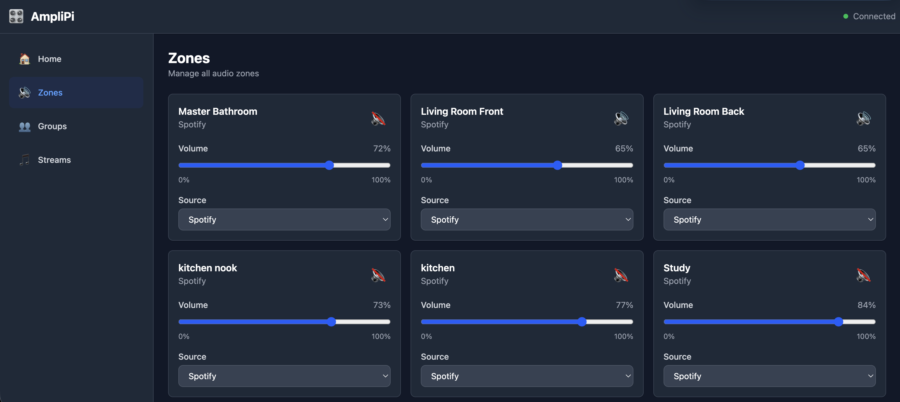
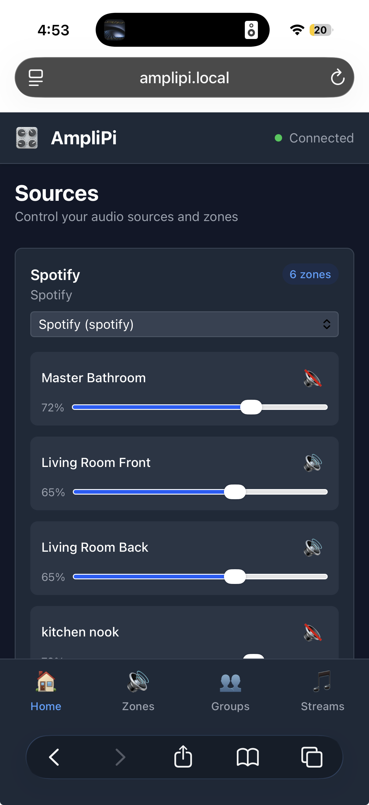

# amplipi-go

A Go replacement for the [AmpliPi](https://github.com/micro-nova/AmpliPi) multi-zone audio system daemon.

AmpliPi is a whole-home audio distribution system supporting up to 4 simultaneous sources and 36 amplified zones. This project re-implements the Python control daemon in Go for improved performance, reliability, and concurrent safety.

## Features

- **Multi-zone audio control**: Control up to 36 zones across 4 simultaneous sources
- **Modern web UI**: Sleek, responsive Svelte 5 interface for desktop and mobile
- **Stream management**: Support for Spotify, AirPlay, Pandora, Internet Radio, DLNA, LMS, and more
- **Group control**: Aggregate control of multiple zones
- **Presets**: Save and load system configurations
- **Real-time updates**: Server-sent events (SSE) for live state synchronization
- **Mock mode**: Development without hardware
- **API compatibility**: Drop-in replacement for Python AmpliPi API

## Architecture

```
cmd/amplipi/          — Binary entry point with embedded web UI
internal/
  models/             — Data structures (JSON-compatible with Python)
  hardware/           — I2C driver (real + mock) for STM32 preamp board
  config/             — Atomic JSON config persistence
  events/             — SSE event bus
  auth/               — Cookie/API-key authentication
  controller/         — State machine (sources, zones, groups, streams, presets)
  api/                — Chi HTTP router + REST handlers
  streams/            — Stream subprocess management
web/                  — Svelte 5 + SvelteKit + Tailwind CSS frontend
```

## Building

### Backend (Go)

```bash
# Install Go dependencies
go mod tidy

# Build for local machine
make build

# Build for Raspberry Pi (ARM64)
make build-pi

# Output: ./bin/amplipi
```

### Frontend (Web UI)

```bash
# Install Node dependencies
cd web
npm install

# Build for production
npm run build

# Development mode with hot reload
npm run dev
```

The production build is automatically embedded in the Go binary via `go:embed`.

## Running

### Mock mode (no hardware required)

Run in mock mode for development and testing — no I2C device needed:

```bash
make run-mock
# or:
./bin/amplipi --mock --addr :8080
```

Then visit:
- **Web UI**: `http://localhost:8080/`
- **API**: `http://localhost:8080/api`

### Real hardware (Raspberry Pi + AmpliPi preamp)

```bash
sudo ./bin/amplipi --addr :80
```

Requires access to `/dev/i2c-1`. Run as root or add user to `i2c` group.

### Deployment to Raspberry Pi

```bash
# Deploy binary to Pi
make deploy

# Deploy and run in mock mode
make deploy-run

# Deploy and run with real hardware
make deploy-run-hw

# View logs
make deploy-logs

# Stop service
make deploy-stop
```

### Flags

| Flag | Default | Description |
|------|---------|-------------|
| `--mock` | false | Use mock hardware driver |
| `--addr` | `:80` | HTTP listen address |
| `--config-dir` | `~/.config/amplipi` | Config directory |
| `--debug` | false | Enable debug logging |

## Web UI

The web UI is built with **Svelte 5** (using runes), **SvelteKit**, and **Tailwind CSS 4**. It provides a modern, responsive interface that works on both desktop and mobile devices.

### Screenshots

#### Desktop View


#### Mobile View


### Features

- **Sources view**: Control audio sources with zone management
- **Zones view**: Individual zone volume, mute, and source assignment
- **Groups view**: Create and manage zone groups for aggregate control
- **Streams view**: View and control streaming services, create new streams
- **Real-time updates**: Auto-polling every 2 seconds for live state sync
- **Dark mode**: Full dark mode support
- **Responsive design**: Desktop sidebar + mobile bottom navigation

### Development

```bash
cd web
npm install
npm run dev  # Development server at http://localhost:5173
npm run build  # Production build to web/dist
```

## API

The REST API is compatible with the Python AmpliPi API. All endpoints are under `/api/`:

- `GET /api` — Full system state
- `PATCH /api/sources/{sid}` — Update source
- `PATCH /api/zones/{zid}` — Update zone
- `PATCH /api/zones` — Bulk zone update
- `POST /api/group` / `PATCH /api/groups/{gid}` / `DELETE /api/groups/{gid}` — Group CRUD
- `POST /api/stream` / `PATCH /api/streams/{sid}` / `DELETE /api/streams/{sid}` — Stream CRUD
- `POST /api/streams/{sid}/{cmd}` — Stream command (play, pause, next, stop, etc.)
- `POST /api/preset` / `PATCH /api/presets/{pid}` / `DELETE /api/presets/{pid}` — Preset CRUD
- `POST /api/presets/{pid}/load` — Apply a preset
- `GET /api/subscribe` — SSE event stream
- `POST /api/factory_reset` — Reset to defaults
- `GET /api/info` — System info

## Development

```bash
make test    # Run tests
make lint    # Run linter (golangci-lint or go vet)
make tidy    # Tidy dependencies
make clean   # Remove binaries
```

## Config

Config is stored at `~/.config/amplipi/house.json` (JSON, compatible with Python format).
Config is written atomically (temp file + rename) with a 500ms debounce.

## Implementation Status

- ✅ **Phase 1**: Models, hardware driver, config store, events, auth
- ✅ **Phase 2**: Controller state machine, REST API, SSE
- ✅ **Phase 3**: Stream subprocess management (Spotify, AirPlay, Pandora, etc.)
- ✅ **Web UI**: Modern Svelte 5 interface with full feature support
- 🚧 **Phase 4**: Updates daemon, display driver, advanced features

## Supported Streaming Services

- **Spotify Connect** (go-librespot)
- **AirPlay** (shairport-sync)
- **Pandora** (pianobar)
- **Internet Radio** (VLC)
- **DLNA/UPnP** (gmrender-resurrect)
- **Logitech Media Server** (squeezelite)
- **Bluetooth** (bluez-alsa)
- **FM Radio** (rtl-sdr/redsea)

## License

GPL-3.0 - See [LICENSE](LICENSE) for details.

## Credits

This project is a Go reimplementation of the original [AmpliPi](https://github.com/micro-nova/AmpliPi) Python daemon by MicroNova.
